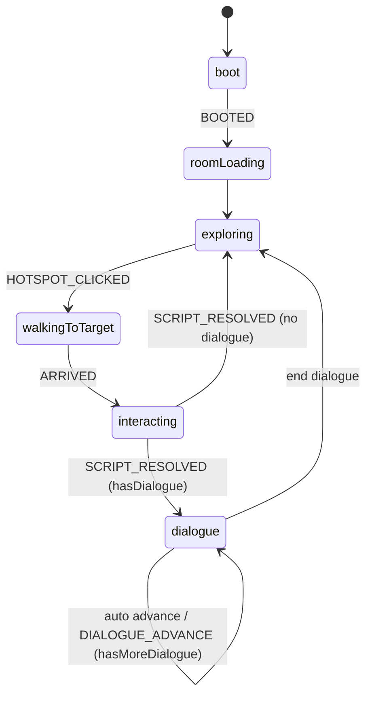
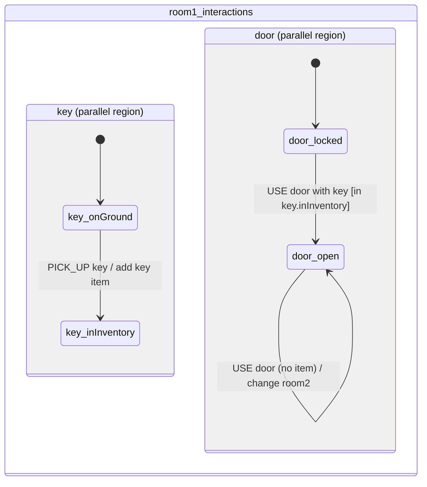

# Monkey-Island-Style Adventure Starter (TypeScript + Vite + XState)

A minimal vertical slice of a point-and-click adventure engine in the browser.

## Commands

To create this from scratch with Vite:

```bash
npm create vite@latest maylay -- --template vanilla-ts
cd maylay
npm install
npm install xstate
```

To run this project:

```bash
npm install
npm run dev:server
npm run dev
npm run build
npm run preview
```

Run `npm run dev:server` and `npm run dev` in separate terminals.

## Deploy to GitHub Pages

This repo includes `.github/workflows/deploy-pages.yml` for automatic Pages deploys.

1. Push this project to GitHub (branch `main` or `master`).
2. In GitHub, open `Settings -> Pages`.
3. Set `Source` to `GitHub Actions`.
4. Push again (or run the workflow manually from `Actions`).

If you removed `origin`, re-add it first:

```bash
git remote add origin https://github.com/<your-user>/<your-repo>.git
git push -u origin main
```

## File Tree

```text
.
|-- index.html
|-- package.json
|-- tsconfig.json
|-- tsconfig.app.json
|-- tsconfig.node.json
|-- vite.config.ts
`-- src
    |-- main.ts
    |-- style.css
    |-- engine
    |   |-- assets.ts
    |   |-- input.ts
    |   `-- renderer.ts
    `-- game
        |-- dialogue
        |   `-- fallbacks.json
        |-- scripts.ts
        |-- stateMachine.ts
        |-- types.ts
        `-- rooms
            |-- room1.json
            |-- rooms.ts
            `-- room2.json
```

## Architecture Overview

- Rendering: `src/engine/renderer.ts`
  - Draws room background, visible hotspots (placeholder rectangles), actor, optional room text.
  - Uses fixed internal resolution `320x180` and nearest-neighbor scaling (`image-rendering: pixelated`).
- Input: `src/engine/input.ts`
  - Converts pointer coordinates from CSS pixels to canvas internal coordinates.
  - Hit-tests hotspots and dispatches machine events (`HOTSPOT_HOVERED`, `HOTSPOT_CLICKED`).
- State and flow: `src/game/stateMachine.ts`
  - XState flow:
    - `boot -> roomLoading -> exploring -> walkingToTarget -> interacting -> dialogue -> exploring`
  - Context includes:
    - `currentRoomId`, `selectedVerb`, `selectedInventoryItemId`, `flags`, `inventory`, `pendingInteraction`
- Game logic scripts: `src/game/scripts.ts`
  - Resolves LOOK / TALK / PICK_UP / USE / OPEN on hotspots.
  - Evaluates room JSON `xstateChart` first, then legacy JSON `scripts`, then defaults.
- Room content: `src/game/rooms/*.json`
  - JSON defines rooms/hotspots/walkable polygons/perspective/scripts/statecharts.
  - `src/game/rooms/rooms.ts` auto-loads and validates all room JSON files.
- Dialogue fallback content: `src/game/dialogue/fallbacks.json`
  - Witty default lines are data-driven and loaded by `src/game/scripts.ts`.

## Statechart Diagrams

### Global Game Flow (`src/game/stateMachine.ts`)



### Room 1 Interaction Chart (`src/game/rooms/room1.json` -> `xstateChart`)



## Sample Gameplay Slice

- Room 1 hotspots: `door`, `sign`, `key`
- Puzzle sequence:
  1. Select `PICK_UP`, click `key` to collect it.
  2. Select `USE`, select `Key` in inventory, click `door` to unlock.
  3. Click `door` again to transition to room2 placeholder.

## How to Add a New Room

1. Add a room JSON file in `src/game/rooms/` (copy `room2.json` as a starter).
2. No manual registration needed; `src/game/rooms/rooms.ts` auto-loads all `*.json`.
3. Add a spawn point in `spawnPointForRoom` in `src/main.ts`.
4. Return `roomChangeTo: 'yourRoomId'` from `resolveInteraction` when appropriate.

## How to Add a Hotspot Interaction

1. Add a hotspot in the room JSON (`id`, `name`, `bounds`, `walkTarget`).
2. Optional sprite config in JSON:
   - `sprite.defaultImageId` (e.g. `"sign"`)
   - `sprite.flagVariants` for state-based swaps (e.g. door closed/open by `doorOpen` flag)
3. Add data-driven behavior in room JSON `scripts`:
   - `hotspotId`, `verb`, optional `inventoryItemId` or `requireNoInventoryItem`
   - optional `conditions.flagsAll/flagsAny/flagsNot`
   - `result` with `dialogueLines`, optional `setFlags`, `addInventoryItem`, `roomChangeTo`, etc.
4. Add behavior in `resolveInteraction` in `src/game/scripts.ts` only for shared fallback logic.
5. If needed, add a visibility rule in `isHotspotVisible`.
6. Use flags/inventory updates through `ScriptResult` fields.

## Dev Mode Persistence

- Start the persistence server: `npm run dev:server`
- Start Vite in a second terminal: `npm run dev`
- In-game dev mode (`F3`):
  - Edit hotspots/walkable polygon
  - Press `S` or click `Save room`
- This writes the current room JSON back to `src/game/rooms/<roomId>.json` through `/api/rooms/:roomId`.
